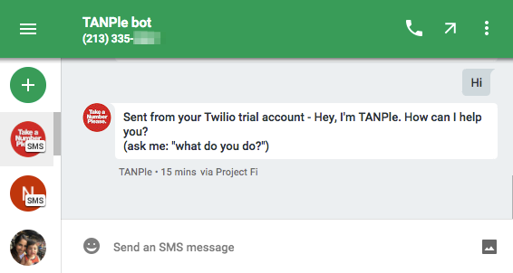
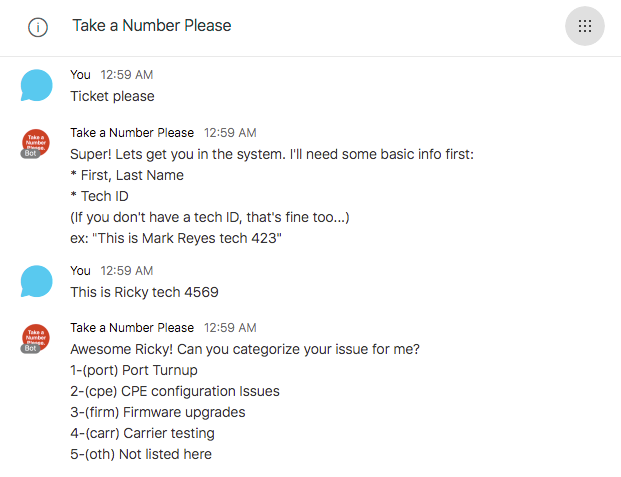
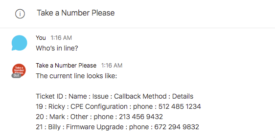
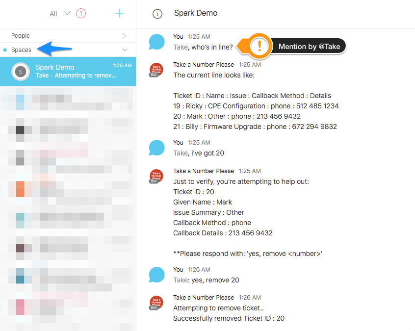

# TANPle 
**Take A Number Please**

Have you ever needed to talk with Customer Support in a department store, but you arrive to find a long line of customers ahead of you? Call-in Customer Support seems to be the same way. You're placed in a phone queue with no idea of who’s in front of you or how far you’ve progressed in the line. Wouldn't you prefer **a call-back system that will contact you** when it's your turn - allowing you to wrap up with the customer or take care of other matters while you're waiting? **A much more efficient and effective way to work!**

That's the same concept behind TANPle! A bot-facilitated digital ticket experience that will free up hours spent waiting on the phone. By gathering just a little information up front, TANPle will allow support teams to do a little pre-engagement leg-work, and possibly resolve issues prior to customer call-back. 

TANPle will categorize issues to 4 main types:

1) Port Turnups
2) CPE Configuration Problems
3) Firmware Upgrades
4) Carrier Testing

Getting Started
------------
With [Dialog Flow's Integrations](https://dialogflow.com/docs/integrations/) this bot can be easily be integrated in many platforms.
There are currently 2 methods implemented: **Cisco Spark**, and **SMS Text messages**. 

### Cisco Spark

In Cisco Spark you will have to search for the TANPle Bot by clicking the '+' sign under people: 

Now you are in a one-to-one conversation with the bot.
You should also be able to invite this bot to group chats as well.

> **Group chats with TANPle**: You will have to mention @Take for interaction. Creating tickets within group Spaces is difficult. 

### SMS Text Messages

TANPle can also be engaged with SMS by any phone's text messaging service. 

Conversations
------------
TANPle has the concept of having a conversation from both the Inbound Customer and Support Team. 
There are 3 main conversations(also known as intents) that are conveyed with this bot: 

1) Creating a ticket for support.
2) Checking the line status.
3) Engaging a customer.

Let's explore how to start these conversations with TANPle.

### Creating A Ticket
To create a ticket for our Support team to follow up with you, say: "Ticket Please"

TANPle will attempt to get some basic information to allow the Support Team to investigate your issue.

### Checking Line Status
To check the current line status, simply ask: "Who's in line?"

### Engaging Customers
When Support Teams are ready to engage a customer, proves to be simple as well. 

* First: Check the line (following the step above) to get a ticket id. 
* Then: Tell TANPle that you are helping that ticket by: "I've got `ticket id`"
* Finally: Confirm you're helping by: "Yes, remove `ticket id`"

> **Note in Group Spaces**: For TANPle to recognize your comment needs attention, you must mention him by: @Take
  

Development and Deployment
------------
Please see our Wiki for development and how to stand up your own instance. 

### Built With

* [Heroku](https://www.heroku.com/) - Web Server and Postgres DB backend
* [Dialogflow](https://dialogflow.com/) - Machine learning conversational middleware
* [Spark](https://developer.ciscospark.com/) - Instant Messaging platform for user frontend
* [Twilio](https://www.twilio.com/) - SMS Messaging platform for user frontend
* [Travis CI](https://travis-ci.org/) - CI/CD pipeline engine for github monitoring

### Contributing

Please read [CONTRIBUTING.md](https://gist.github.com/PurpleBooth/b24679402957c63ec426) for details on our code of conduct, and the process for submitting pull requests to us.

### Versioning

We use [SemVer](http://semver.org/) for versioning. For the versions available, see the [tags on this repository](https://github.com/your/project/tags).

### Authors

* **Mark Reyes** - *Initial work* - [Send Mark a note](mailto:mark.reyes@charter.com)

See also the list of [contributors](https://github.com/your/project/contributors) who participated in this project.

### Acknowledgments

Special Thanks to Graham and Clara for their Python expertise and guidance. 