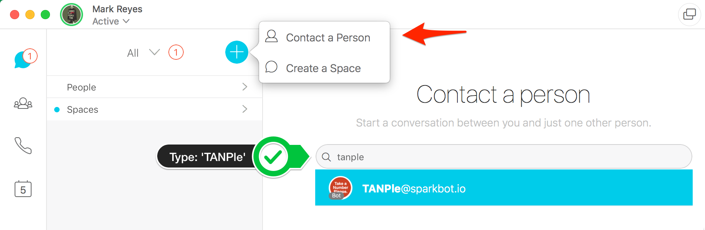

# TANPle 
**Take A Number Please**

Have you ever approached a customer service desk in a department store to find a ticket dispenser? Once you pulled a ticket from the dispenser, you're free to roam and take care of other business while waiting for support to be free to help.

That's the same concept behind TANPle! A bot facilitated digital ticket experience that will free up technician time while waiting on the phone. This will allow support teams to do a little leg-work, and possibly resolve issues prior to engagement. A much needed improvement over the blind inbound call queue. 

TANPle will categorize issues to 4 main types:
1) Port Turnups
2) CPE Configuration Problems
3) Firmware Upgrades
4) Carrier Testing


Getting Started
------------
With [Dialog Flow's Integrations](https://dialogflow.com/docs/integrations/) this bot can be easily be integrated in many platforms.
There are currently 2 methods implemented: **Cisco Spark**, and **SMS Text messages**. 

### Cisco Spark

In Cisco Spark you will have to search for the TANPle Bot by clicking the '+' sign under people: 



Now you are in a one-to-one conversation with the bot.
You should also be able to invite this bot to group chats as well.*

> Group chats with TANPle: You will have to mention @Take for interaction. Creating tickets within group Spaces is difficult. 

### SMS Text Messages

What things you need to install the software and how to install them

```
Give examples
```

Installing
------------

A step by step series of examples that tell you have to get a development env running

Say what the step will be

```
Give the example
```

And repeat

```
until finished
```

End with an example of getting some data out of the system or using it for a little demo

## Running the tests

Explain how to run the automated tests for this system

### Break down into end to end tests

Explain what these tests test and why

```
Give an example
```

### And coding style tests

Explain what these tests test and why

```
Give an example
```

## Deployment

Add additional notes about how to deploy this on a live system

## Built With

* [Dropwizard](http://www.dropwizard.io/1.0.2/docs/) - The web framework used
* [Maven](https://maven.apache.org/) - Dependency Management
* [ROME](https://rometools.github.io/rome/) - Used to generate RSS Feeds

## Contributing

Please read [CONTRIBUTING.md](https://gist.github.com/PurpleBooth/b24679402957c63ec426) for details on our code of conduct, and the process for submitting pull requests to us.

## Versioning

We use [SemVer](http://semver.org/) for versioning. For the versions available, see the [tags on this repository](https://github.com/your/project/tags).

## Authors

* **Billie Thompson** - *Initial work* - [PurpleBooth](https://github.com/PurpleBooth)

See also the list of [contributors](https://github.com/your/project/contributors) who participated in this project.

## License

This project is licensed under the MIT License - see the [LICENSE.md](LICENSE.md) file for details

## Acknowledgments

Author: Mark Reyes 

Last Update: 3/3/2018
